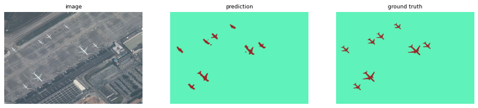

# Object Detection Using Adaptive Mask RCNN in Optical Remote Sensing Images

In this project, we are focusing on implementing and fine-tuning a Mask R-CNN model for object detection in optical remote sensing images. We will be reproducing the methodology proposed in the paper "Object Detection Using Adaptive Mask RCNN in Optical Remote Sensing Images," published in the International Journal of Intelligent Engineering and Systems.

## Table of Contents

1. **Object Detection Models**
   
   Object detection is a crucial task in computer vision, enabling machines to identify and locate objects within an image or video. One of the prominent approaches in this field is the Mask R-CNN (Region-based Convolutional Neural Network) model.
   
3. **Mask R-CNN architecture**
   
   The Mask R-CNN architecture consists of two main components: the backbone network and the region proposal network (RPN). The backbone network, often based on a pre-trained CNN such as ResNet, extracts features from the input image. The RPN then generates region proposals, which are candidate bounding boxes that may contain objects. These proposals are refined by a bounding box regression network and a classification network to produce the final detections. Additionally, Mask R-CNN includes a mask prediction branch that generates segmentation masks for each detected object.
   
4. **Problem Domain**

   The research paper addresses the problem of object detection in optical remote sensing images. The objective is to develop a method that can accurately detect and classify objects in high-resolution remote sensing images, which can have applications in various fields such as agriculture, urban planning, and environmental monitoring.
   
6. **DataSet Overview**
   
   NWPU VHR-10 data set is a challenging ten-class geospatial object detection data set. This dataset contains a total of 800 VHR optical remote sensing images, where 715 color images were acquired from Google 
   Earth with the spatial resolution ranging from 0.5 to 2 m, and 85 pansharpened color infrared images were acquired from Vaihingen data with a spatial resolution of 0.08 m.
   The data set is divided into two sets:
     . Positive image set which contains at least one target in an image contains 650 images.
     . Negative image set contains 150 images and it does not contain any targets.
   From this the positive image set, 757 airplanes, 302 ships, 655 storage tanks, 390 baseball diamonds, 524 tennis courts, 159 basketball courts, 163 ground track fields, 224 harbors, 124 bridges, and 477 
   vehicles were manually annotated with bounding boxes and instance masks used for ground truth.
